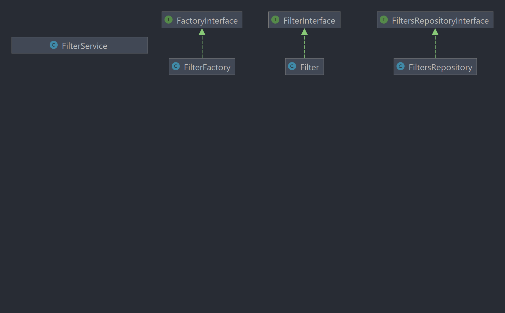

# **EloquentQueryFilter**
Package is developed for quick and easy managing filtering in your application.
### Usage:
Create a new class and extend **FiltersRepository** class or implement **FiltersRepositoryInterface** 
Then you can redefine *setFilters()* method.

    class UserFiltersRepository extends FiltersRepository
    {
	    public function setFilters(): void
        {
            $this->makeNewFilter('activated', function($query){
                return $query->where('activated', true);
            });
        }
	}

After setting up your repository for filters you can use it anywhere with FilterService.

    private function getUsers()
    {
        $usersFilterService = new FilterService(User::class);
        $users = $usersFilterService
            ->loadFiltersFromClass(UserFiltersRepository::class)
            ->setFilters(['activated'])
            ->getBuilder()
            ->get();
        return $users;
	}

It may look more complicated than writing query straight in needed place,
but in fact you will get no repetitive code and will be free to use your filters
anywhere you need it and change it easily

Every method is well explained in **FilterService** class, so it's easy to understand how you can interact with it.
I hope this package will help you in development. Feel free to open issues if needed. Contributors are also welcomed!
